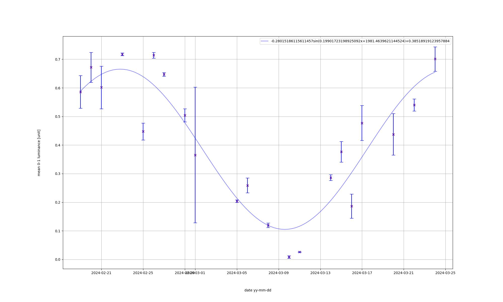

# about
- my `phys183 - the milky way` term hw
- moon luminosity time series data/plot

## data collection
1. found moons position every moonrise using [moonrise time](https://www.timeanddate.com/moon/canada/oakville) **missing days b.c moon not always visible**  
2. took 2 photos of moon every moonrise using iphone 13 camera on lowest exposure
3. cropped photos to unit squares around moon
4. read imgs into `m x n` grayscale tensors where `px in [0-1]`
5. for each img calculated `lum = #px > 0.8 / #px total`
6. plotted luminosity data and sin trend line

### graph
